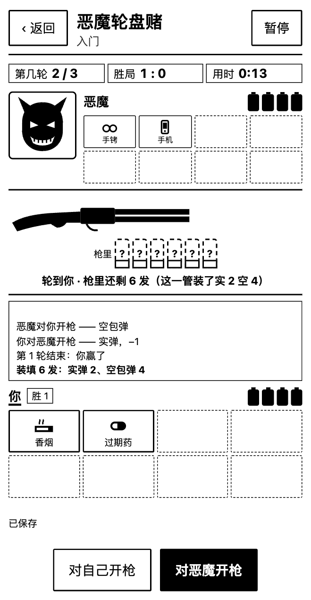
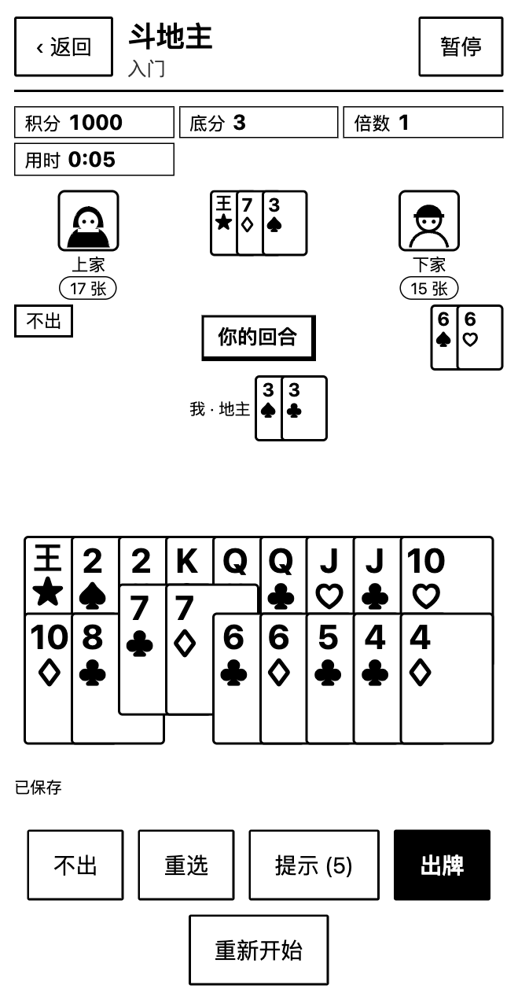
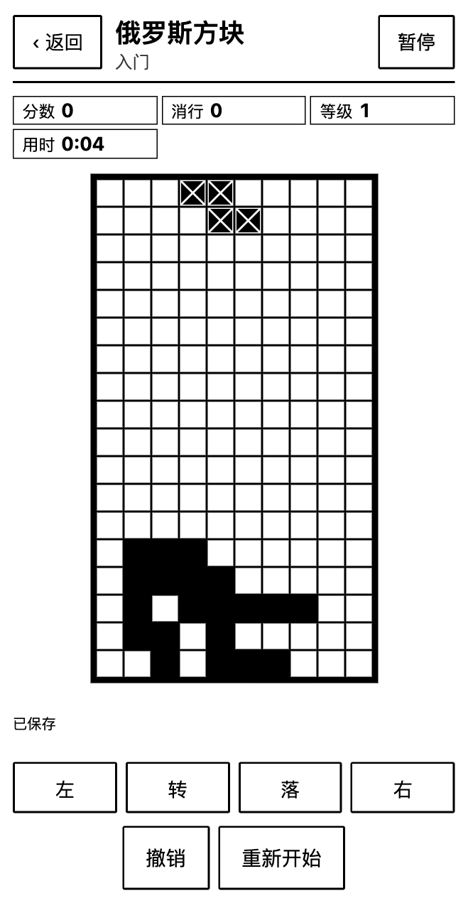
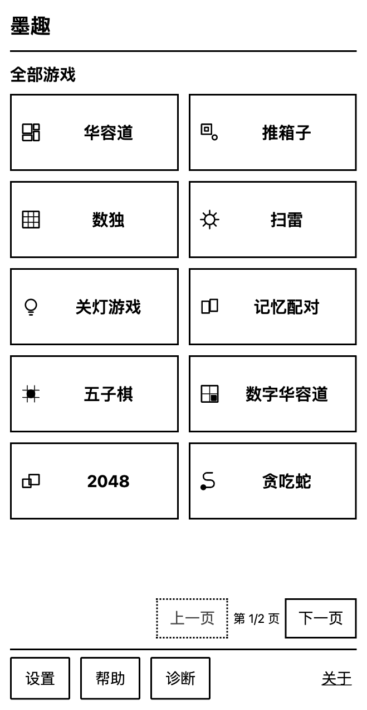
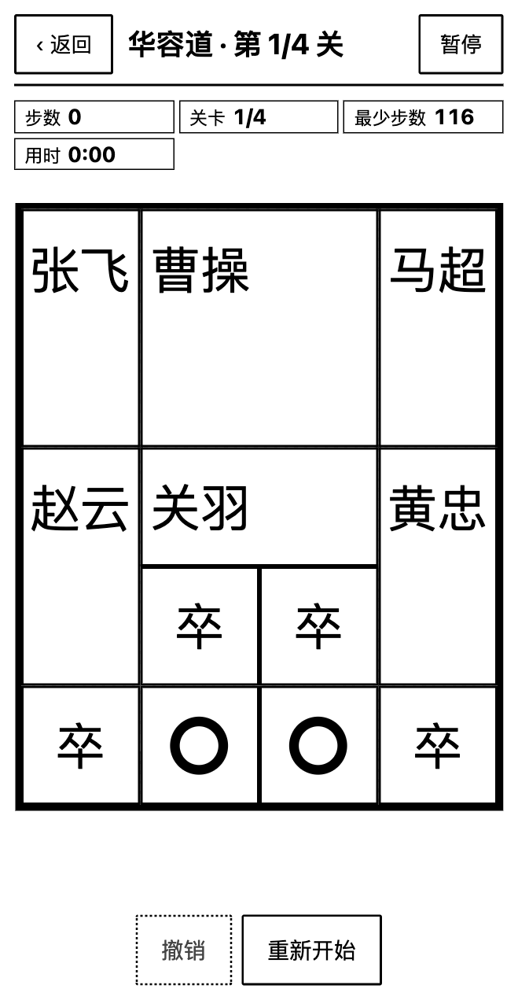
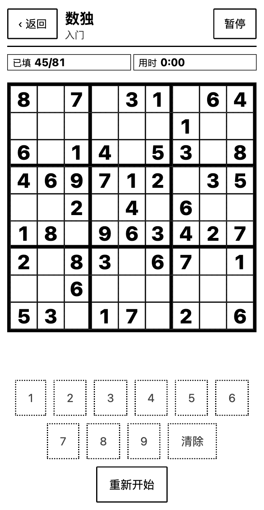
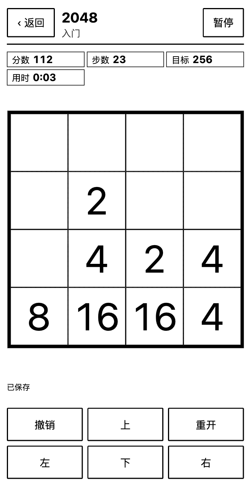
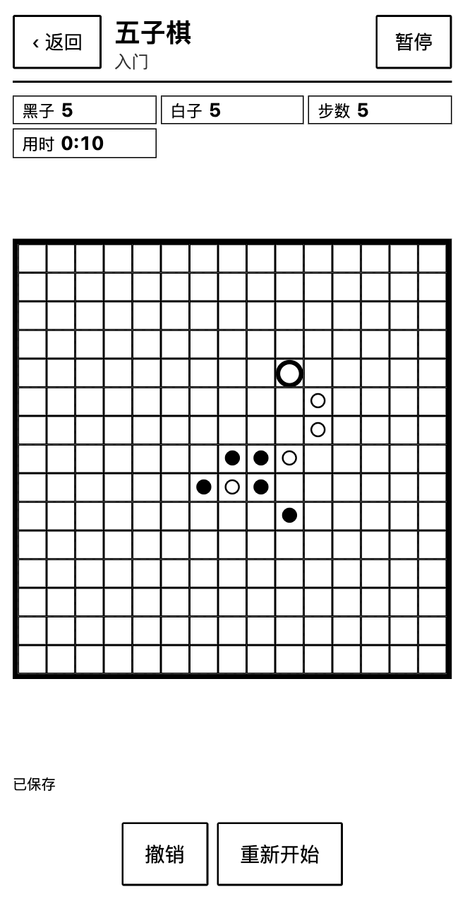
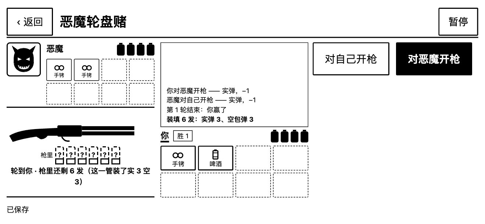

<div align="center">


# 墨趣 · Moqu

**为墨水屏而生的离线游戏合集**

*An offline game collection designed for e-ink screens*

<p>
  
  
  
  
  <br>
  
  
  
  
</p>

[游戏一览](#-游戏一览) · [快速开始](#-快速开始) · [设计理念](#-为墨水屏而设计) · [架构](#-架构) · [质量保障](#-质量保障) · [文档](#-文档索引)

</div>

---

墨趣是一套 **TypeScript monorepo**，同一份代码产出两个端：可安装的 **Web PWA**，以及可侧载的 **Android APK**（优先适配 BOOX）。
它不是把手机游戏搬到墨水屏上，而是围绕墨水屏的特性从头设计的：**纯黑白、没有动画、点按优先、分页代替滚动、断电不丢进度**。

<br>

<table>
  <tr>
    <td align="center" width="25%"><br><sub><b>恶魔轮盘赌</b> · 第 2 轮，8 种道具</sub></td>
    <td align="center" width="25%"><br><sub><b>斗地主</b> · 叫 3 分当地主</sub></td>
    <td align="center" width="25%"><br><sub><b>俄罗斯方块</b> · 平铺方向键</sub></td>
    <td align="center" width="25%"><br><sub><b>游戏库</b> · 分页，不滚动</sub></td>
  </tr>
  <tr>
    <td align="center"><br><sub><b>华容道</b> · 显示最少步数</sub></td>
    <td align="center"><br><sub><b>数独</b> · 点格子 + 数字键</sub></td>
    <td align="center"><br><sub><b>2048</b> · 滑动或方向键</sub></td>
    <td align="center"><br><sub><b>五子棋</b> · 对战三档电脑</sub></td>
  </tr>
</table>

<p align="center">
  <br>
  <sub>横屏时自动换成左右两栏（容器查询，不依赖设备名单）。截图为 439×847 / 879×407 视口下的实际渲染。</sub>
</p>

---

## ✦ 亮点

<table>
  <tr>
    <td width="33%" valign="top">
      <h4>◼ 1-bit 视觉</h4>
      所有图形都是纯黑、纯白，没有灰阶渐变，也没有过渡动画。蛇身是一根连续的黑管，扑克牌、电池格血量和弹壳全部用 SVG 自绘，在墨水屏上没有残影负担。
    </td>
    <td width="33%" valign="top">
      <h4>◼ 断电不丢进度</h4>
      存档用「写前日志 + 比较交换提交」。进程被杀、设备没电，重新打开后都能回到<b>最后一次明确提交成功</b>的局面，不会停在半步。
    </td>
    <td width="33%" valign="top">
      <h4>◼ 真正离线</h4>
      资源全部内置，装好之后再也不需要联网。Android 壳不含任何厂商 SDK，<b>不申请任何权限</b>；Web 端由 Service Worker 离线缓存。
    </td>
  </tr>
  <tr>
    <td valign="top">
      <h4>◼ 确定性、可重放</h4>
      规则全部是纯函数，随机数由种子派生。斗地主、恶魔轮盘赌这类有隐藏信息的游戏，存档只存<code>(种子, 操作日志)</code>，读档时整局重放校验，篡改的存档会被识别。
    </td>
    <td valign="top">
      <h4>◼ 为翻页屏调过的交互</h4>
      游戏库分页显示，不用滚动；方向键可以平铺、可以隐藏，也支持滑动。暂停菜单直接出现在原地，不弹新页面。字号有 1× / 1.25× / 1.5× 三档，横竖屏各有布局。
    </td>
    <td valign="top">
      <h4>◼ 中英双语</h4>
      所有界面文字都走 i18n key，中英字典的 key 逐条对齐。构建前还会扫描源码，一旦出现硬编码中文，检查就会失败。
    </td>
  </tr>
</table>

---

## 🎮 游戏一览

当前收录 **14 款**，除双人模式外每款都有 *入门 / 熟练 / 挑战* 三档。

### 益智解谜

| 游戏 | 玩法亮点 |
|---|---|
| **推箱子** | 自制关卡包：房间模板配合固定种子反向生成，每一关都经过求解器校验，保证可解 |
| **华容道** | 把曹操挪到出口，按关推进，并显示最少步数 |
| **数独** | 9×9 盘面，先点格子再点数字键 |
| **扫雷** | 点格子翻开，可以切换标记模式 |
| **关灯游戏** | 5×5 和 6×6 两种盘面，一次翻转十字范围的灯 |
| **数字华容道** | 3×3 / 4×4 / 5×5，直接点数字块滑动，方向键默认隐藏 |
| **记忆配对** | 翻开两张牌，符号相同即配对 |
| **2048** | 滑动或方向键，同一次移动里每块只合并一次 |
| **消消乐** | 交换相邻两格凑成三连，凑不成三连的交换不扣步数 |

### 棋牌对战

| 游戏 | 玩法亮点 |
|---|---|
| **五子棋** | 你执黑先手，对战三档电脑 |
| **斗地主** | 标准三人局，叫分制，炸弹和春天翻倍，积分跨局累计；牌局引擎按座位驱动，**已留联机框架**（协议 + 权威主机 + 回环测试） |
| **恶魔轮盘赌** | 实弹和空包弹的心理博弈。8 种道具（放大镜、香烟、啤酒、手铐、手锯、手机、逆转器、过期药），共 3 轮，血量 2 → 4 → 6；可以对战三档恶魔，也可以**双人同屏** |

### 动作街机

| 游戏 | 玩法亮点 |
|---|---|
| **贪吃蛇** | 三档分别是可穿墙、实心墙、障碍加长两节；方向键或滑动立即走一格 |
| **俄罗斯方块** | 下落间隔 1.05 / 0.8 / 0.6 秒，平铺的「左 · 转 · 落 · 右」按键 |

> [!NOTE]
> 自动步进的游戏（贪吃蛇、俄罗斯方块，以及斗地主和恶魔轮盘赌的电脑回合）由壳层计时，页面隐藏或暂停时计时会停止；最短间隔是 400ms，免得墨水屏刷不过来。

---

## 🚀 快速开始

```bash
# 依赖（Node 20.19+ / 22.12+，实测 Node 24）
npm install

# 本地预览 Web 端 → http://127.0.0.1:5173
npm run dev:web

# 提交前必跑：类型检查 + 全部测试 + 文案校验 + 构建 + 文档 / 接入核对
npm run check
```

<details>
<summary><b>构建 Android APK</b></summary>

<br>

```bash
# 一次性安装构建链到 .toolchain/（JDK 17 + Android SDK 35 + Gradle 8.14.3，约 1GB）
npm run setup:android

# 构建可侧载的 debug APK
npm run build:apk
# → apps/android/app/build/outputs/apk/debug/app-debug.apk

# 侧载到设备
adb install -r apps/android/app/build/outputs/apk/debug/app-debug.apk
```

最低支持 Android 6.0（minSdk 23），target 35。真机验收流程见 [docs/A06-acceptance.md](docs/A06-acceptance.md)。
首次运行请先在应用里打开 **设置 → 诊断**，复制设备基线，回填到 [docs/A01-device-baseline.md](docs/A01-device-baseline.md)。

</details>

<details>
<summary><b>常用命令</b></summary>

<br>

| 命令 | 作用 |
|---|---|
| `npm run dev:web` | 本地开发服务器 |
| `npm run typecheck` | 全仓 TypeScript 检查 |
| `npm test` | 全部单元测试：规则、关卡可解性、存档协议、布局不变量、壳层集成 |
| `npm run check:i18n` | 中英字典对齐，并扫描硬编码中文 |
| `npm run build:web` | 构建 Web 产物并生成 `sw.js` |
| `npm run check` | 以上全部，再加文档核对与游戏接入核对（提交前跑这个） |
| `npm run check:games` | 逐款核对接入点：别名、链接、登记、字形、契约测试、i18n |
| `npm run explore` | 浏览器探索套件：逐页逐游戏、最大字号、极矮横屏 |
| `npm run gen:levels` | 重新生成推箱子关卡包（会改写 `src/levels.ts`） |
| `npm run setup:android` / `npm run build:apk` | 安装构建链 / 构建 APK |

</details>

---

## ◐ 为墨水屏而设计

墨水屏和手机屏幕的物理特性完全不同，下面这些都是刻意的取舍：

| 取舍 | 原因 |
|---|---|
| **DOM / SVG，不用 Canvas** | 网页没法承诺像素级局部刷新。DOM 让系统自己做最小重绘，中文也直接用系统字体 |
| **没有动画** | 每一帧都意味着一次刷新和残影。状态直接跳到结果，发生了什么用文字交代，比如恶魔轮盘赌的「最近」记录 |
| **分页代替滚动** | 滚动在墨水屏上又慢又糊，游戏库和关卡列表放不下时改成翻页，翻页按钮固定在页脚 |
| **输入不防抖，存档才合并** | 每次被接受的输入都立刻出画；持久化在 500ms 窗口内合并，过关、暂停、切到后台时立即提交 |
| **布局按棋盘区算** | 格子大小由容器查询单位（`cqw` / `cqh`）纯 CSS 计算，窄竖屏、极矮横屏、大屏都单独验过 |

**明确不承诺的能力**（详见 [docs/eink-guidelines.md](docs/eink-guidelines.md)）：

- 不做像素级局部刷新：网页和 WebView 都只能拿到**整屏全刷**和**应用级刷新模式**；
- 不承诺「零残影」：残影和全刷效果必须在真机上观察并记录；
- 桌面截图或模拟器通过，**不算**完成验收。

---

## ⧉ 架构

```
apps/web  ─┐                     ┌─ packages/ui        React 壳层：页面、组件、会话
           ├─ packages/platform ─┤
apps/android┘  存储 / 离线 / 刷新 └─ packages/games/*   规则 + 展示模型 + 内容
                                          └─ packages/core   契约 / 存档 / i18n / 布局
```

依赖方向严格单向：`apps → ui / platform → games → core`。`core` 里不出现 DOM、React、WebView 或 Android，`games` 里也不出现任何平台概念。

**一次输入的完整路径：**

```
玩家点「上」
  → GameDef.reduce(state, action)      纯函数；非法动作抛 IllegalActionError，给出文字提示且不进日志
  → 立即出画（不防抖）
  → applyAction(存档, encode(next))    写前日志 + 校验和
  → SaveStore.commit(...)              CAS 提交栅栏：pending → committed → 删除 pending
                                       崩溃后 recover 能确定落在哪一边
```

**每款游戏是一个独立包，只实现一份 `GameDef` 契约：**

```ts
create(seed, difficulty) → state          // 确定性开局
reduce(state, action)    → state          // 纯函数
legal / status / view / controls          // 合法动作、胜负、展示模型、按钮
encode / decode                           // 存档；有隐藏信息的游戏用重放校验
tickMs?(state)                            // 需要自动步进时声明间隔，计时器只在壳层
```

展示模型有三种，壳层按需渲染：**格子棋盘**（`board`）、**牌桌**（`table`，斗地主）、**对决面板**（`duel`，恶魔轮盘赌）。
新增游戏的步骤见 [docs/game-authoring.md](docs/game-authoring.md)，`npm run check:games` 会逐条核对 5 个接入点。

<details>
<summary><b>目录结构</b></summary>

<br>

```
packages/core/        规则契约、确定性随机、i18n 运行时、存档与提交协议、备份、布局纯函数、设置
packages/games/*/     14 款游戏，每款一个包：规则、展示模型、文案、内容（推箱子 / 华容道的关卡包带求解器校验）
packages/ui/          React 壳层：游戏库、详情、游戏界面、结果、设置、诊断、帮助
packages/platform/    平台适配：IndexedDB / Android 原生事务存储、离线状态、刷新控制、设备基线
apps/web/             Vite + React 的 PWA 入口（产物同时打进 APK）
apps/android/         Kotlin WebView 壳：原生 SQLite 存储、SAF 备份；icon/ 下是图标源图与生成器
tools/scripts/        工具链安装、APK 构建、Service Worker 生成、文案扫描、探索与审计套件
docs/                 规划与验收文档（A01–A06）、架构、墨水屏规范、上手指南、交接说明
```

</details>

---

## ✓ 质量保障

| 层级 | 内容 |
|---|---|
| **单元测试** | 1200+ 个（Vitest），覆盖规则、关卡可解性、存档协议、布局不变量、壳层集成 |
| **跨游戏契约** | 每款游戏的每档难度都随机走 60 步合法动作，每一步做 encode → decode 往返；自动步进只在声明的阶段发生 |
| **整局模拟** | 斗地主、恶魔轮盘赌在测试里按每档难度打完整局，每一步做存档往返；各档电脑强度另做过 2000 局 / 档的胜率统计（见交接说明） |
| **文案与文档** | 中英 key 对齐、硬编码中文扫描；交接文档里的命令、路径、游戏数量必须与仓库一致 |
| **浏览器探索** | Playwright 逐页逐游戏巡检：最大字号、极矮横屏（879×407）、按钮可达、无缺键、无裁切 |
| **真机审计** | BOOX P6Plus（439×847）与 NoteX2（1248×903）实测，截图存档在 [`docs/screens/`](docs/screens/) |

---

## ◉ 图标

墨水滴里藏着一个游戏手柄（十字键 + 两个按钮），纯黑白 1-bit。
源图是 [`apps/android/icon/source.png`](apps/android/icon/source.png)，**换图标只需替换这张图，再重跑生成器**：

```bash
python3 apps/android/icon/gen-icons.py   # 依赖 Python 3 + Pillow
```

生成器一次产出 Android 启动图标（各密度 PNG 和 adaptive 矢量前景）以及 Web 的 favicon、PWA 图标、`icon.svg`，并做两项自检：
- 所有 PNG 只含纯黑、纯白、全透明像素；
- 矢量版与源图的重合度（IoU）不低于 0.98。

16px favicon 做了小尺寸光学补偿：十字键和按钮按像素手工挖出，否则两个按钮会糊成一团。

---

## ☰ 文档索引

| 文档 | 内容 |
|---|---|
| [handover.md](docs/handover.md) | **接手先读**：当前检查点、各轮变更、真机数据、待办 |
| [architecture.md](docs/architecture.md) | 分层、数据流、存档协议 |
| [game-authoring.md](docs/game-authoring.md) | 新增一款游戏的完整步骤 |
| [eink-guidelines.md](docs/eink-guidelines.md) | 墨水屏界面规范与不承诺事项 |
| [refresh-adaptation.md](docs/refresh-adaptation.md) | 刷新模式适配 |
| [android.md](docs/android.md) | Android 壳的实现细节 |
| [verification.md](docs/verification.md) | 验证记录与探索套件说明 |
| [A01](docs/A01-device-baseline.md) – [A06](docs/A06-acceptance.md) | 设备基线、范围、依赖、页面、分发、验收 |

---

## 许可证与内容来源

关卡内容为自制（房间模板 + 固定种子反向生成 + 求解器校验），不包含第三方题库。
依赖与 SDK 的来源和使用条件见 [docs/A03-dependencies.md](docs/A03-dependencies.md)。

<div align="center">
<br>
<sub>墨趣 · 在墨水屏上，慢慢玩。</sub>
</div>
