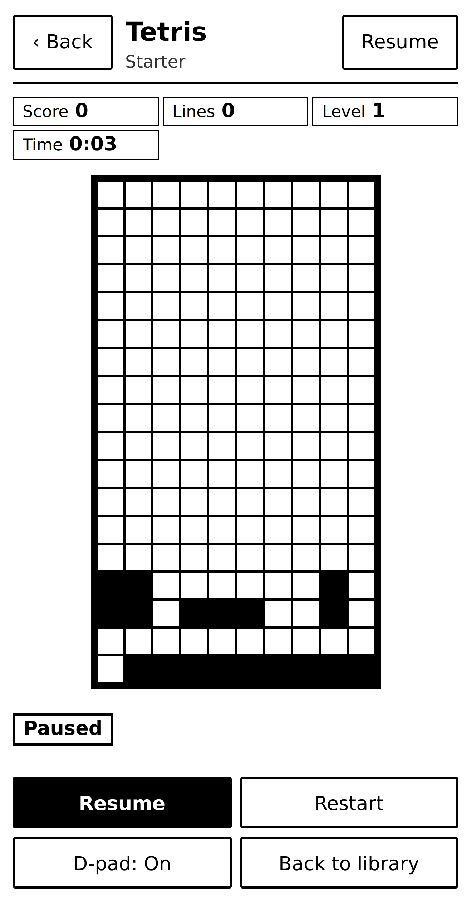
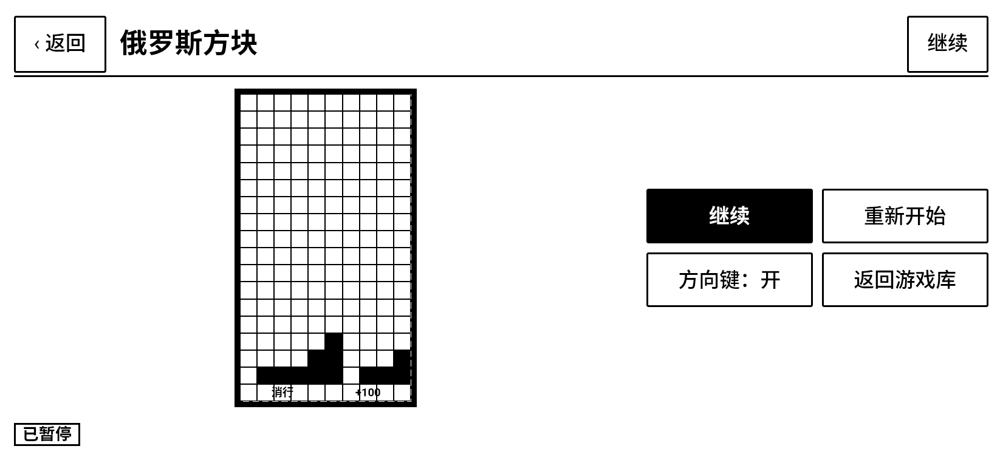
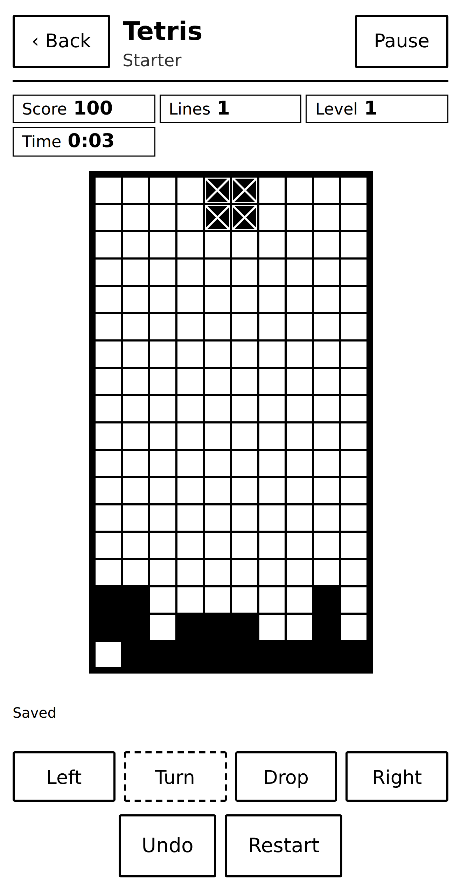
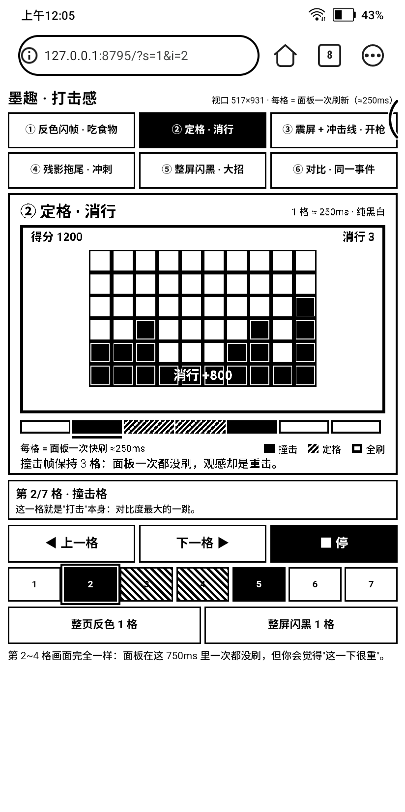
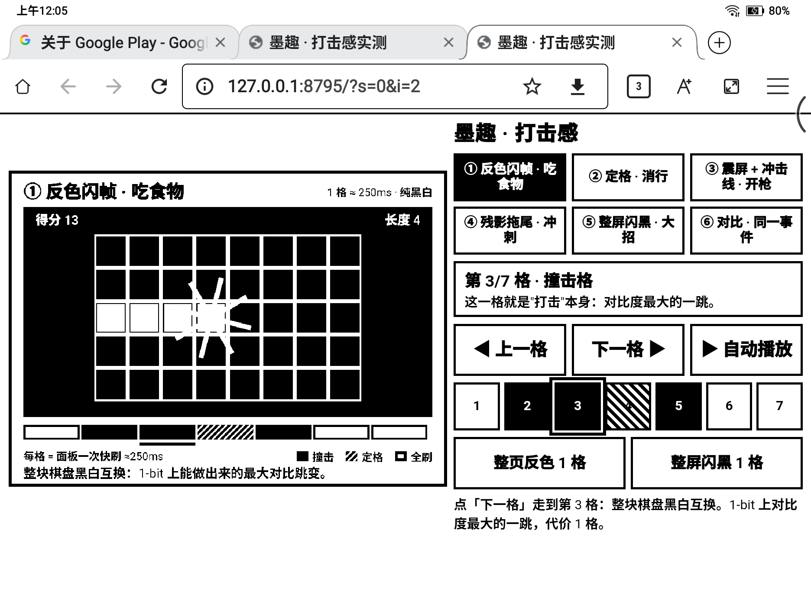

# 墨水屏上的「打击感」示例

六张动图，每张演示一种在 **1-bit、一次快刷 ≈250ms** 的面板上真正成立的手段。

**动图里的一帧 = 面板的一次刷新。** 看这些动图，等于在看面板每一格会画出什么：
标尺上 ■ 是撞击格、▨ 是定格格（重复同一帧 = 面板一次都不刷）、● 是全刷格。

| 动图 | 手段 | 用掉的刷新槽 | 关键点 |
|---|---|---|---|
| `docs/juice/01-invert-flash.gif` | 反色闪帧 | 2 | 整块棋盘黑白互换：1-bit 上最大的对比跳变 |
| `docs/juice/02-hold.gif` | 定格 | +3（重复帧） | 撞击帧停 3 格，**面板零刷新**，代价只是时间 |
| `docs/juice/03-slam-burst.gif` | 震屏 + 冲击线 | 3 | 位移本身就有打击感，不需要过渡动画 |
| `docs/juice/04-ghost-trail.gif` | 残影拖尾 | 3 + 1 全刷 | 残影清不干净就拿来当拖尾，之后一次全刷收干净 |
| `docs/juice/05-black-flash.gif` | 整屏闪黑 | 1 | 面板能做的最响的一下，成本只是一次刷新 |
| `docs/juice/06-compare.gif` | 对比 | — | 同一事件：左边一次状态变化，右边三层反馈 |

## 四条判据（为什么是这几种，而不是「加个动画」）

1. **不能加平滑动画**：面板约 2 次全刷/秒，比它更快的变化会被丢掉，看起来只是跳变加残影
   （见 [refresh-adaptation](../refresh-adaptation.md)）。所以打击感只能来自
   **离散状态之间的对比度**，以及**这些状态各停留多久**。
2. **一次冲击 = 两到三次状态变化**：变化本身（吃 / 消 / 中弹）→ 对比跳变（反色 / 闪黑）→
   结论（大数字 / 破碎）。三次都是一整帧，没有中间帧。
3. **停留时间是最便宜的打击感**：定格格在渲染上什么都不用做 —— 面板保持不动，
   玩家看到的却是「这一下很重」。代价是这段时间玩法不推进，所以只给大事件用（≤2 格）。
4. **1-bit 里没有「半透明」**：碎片、残影这种半透明观感只能靠抖动（棋盘格网点）表达；
   覆盖层必须是实心的 —— [eink-guidelines](../eink-guidelines.md) 里已经判过，
   浮层方案在墨水屏上等于实心遮住棋盘，不成立。

## 已经落地的第一处：俄罗斯方块「消行定格 + 黑带标注」

六张动图里的 ② 已经做进 `packages/games/tetris`，可以直接在游戏里看：

| 环节 | 落点 | 说明 |
|---|---|---|
| 定格三拍 | `rules.ts` 的 `PendingClear.phase` + `advanceClear` + `commitClear` | 填满行时**先不消行**：满行留在棋盘上、分数与消行数都不动。第一个 `tick` → 变白拍，第二个 `tick` → 黑字拍，第三个 `tick` 才真正消掉并把上面的方块落下来 |
| 每拍多长 | `rules.ts` 的 `CLEAR_HOLD_MS = 500`（`index.ts` 的 `tickMs` 在定格时返回它） | 每拍 500ms，不跟难度走 —— 它不是难度旋钮而是**面板的物理时间**（一次整屏刷新 ≈500ms，短于它这一帧还没画完就被覆盖） |
| ① 整行变白 | `view.ts` 给那几行标 `CellView.flash`，壳层打 `data-flash`，样式把黑格翻成白格（连字色一起翻） | 一格只有黑白两态，"整行变白"就是最醒目的标记；压在黑堆上是一条白带 |
| ② 白底黑字 | `view.ts` 的 `clearBandCells` + 契约的 `CellView.glyphKey` / `banner` | 白带**保持白**，上面出黑字：左「消行」右这一下拿到的分；多行同时消掉时只写在**中间那一行** |
| ③ 消失 + 下落 | `commitClear` 里的 `clearRows` | 白带连字一起消失，上面的方块整体落下来（同一帧，规则上就是一次状态变化） |
| 三拍都不画当前块 | `view.ts` 的 `buildBoard` | 方块已经并进棋盘，再画成「黑底白叉」的活动块，玩家会以为它还能动 |

> **反色被否掉了**：最早这一拍是「整盘反色」（`filter: invert(1)`，对应动图 ①）。
> 用户看过真机后的意见是「改成定格+消行，右边显示分数，不要反色」——
> 整盘反色把棋盘信息一起翻掉，而黑带上的白字既醒目又不丢信息。
> 契约里的 `BoardView.invert` 与壳层的反色样式已随之删除，不留没人用的能力。

**为什么值得这么写**：这一拍没有引入任何新机制 —— 它就是一个普通的 `tick`（壳层本来就要派发），
没有计时器、没有动画、没有新权限。规则层依旧是纯函数，存档格式只多了一个可选字段
（老存档缺字段按 null 处理，天然兼容）。

三条容易被忽略的约束（写代码时都踩过）：

1. **定格中必须保持存档不变式**。`cursor === pieces + 1` 与 `piece.id === pieceAt(seed, cursor-1)`
   是 `decodeState` 的核心校验；定格这一拍里 `cursor` / `pieces` **都先不加**（它们和分数一起在
   定格结束时才跳），这两条才继续成立 —— 否则「定格中存档 → 重开」会被判成存档损坏。
   `decodeState` 另外新查两条：定格的每一行在棋盘上**确实是满的**、当前块**确实已经并盘**。
2. **定格中拒绝移动**（明确抛错，由会话给出「走不通」提示），而不是静默吞掉输入：
   规范 5 是「输入被接受就必须产生状态变化」，静默返回原状态会变成「按了没反应」。
3. **白带上不要加描边**：白格在白底棋盘上看不出边界，第一版给它加过 3px 内框 ——
   结果第二拍的黑字一横跨过去就被内框吃掉半截（浏览器实测 `Line clear` 被切成 `L ne c ea `）。
   用户要的是"白底黑字"，所以描边去掉：白带靠在黑堆上的对比读出来，字反而干净。
4. **文字比格子宽时会被相邻格盖掉**（浏览器 + 真机都复现）：黑带上的 `Line clear` 只剩 `Line cl`、
   `+100` 只剩 `+10` —— 后面的兄弟格后画，它们的背景正好压在溢出部分上。
   修法是 `CellView.banner`：壳层把这类文字**绝对定位锚在自己这一格**上（`left/top 50%` + `translate(-50%,-50%)`），
   定位元素在绘制顺序里晚于普通流兄弟，于是压得住相邻格；它仍然跟着格子走 ——
   这不是「覆盖层自成一坐标系」那套（那套在真机上整体错过位，已被删除）。
   顺带一条：**文案不能写进 `glyph`**（`消行` 是中文，`check-i18n.mjs` 会直接拦），
   所以契约新增了 `glyphKey`，由壳层翻译后再渲染。

### 真机实拍：定格那一拍

在 BOOX P6Plus 上跑构建产物、用一个基于页面 DOM 的小机器人打到消行（脚本在
`.toolchain/verify-tetris-juice.mjs`，可经 CDP 直接驱动真机 Chrome **或应用内 WebView**），
并在定格那一拍**点暂停把它冻住**，才有稳定的截图：

<p>
  
  
  
</p>

三张连起来就是一个消行：**第一拍**那几行整行变白（分数与消行都还没动）→
**第二拍**白底黑字、左「消行」右「+100」→ **第三拍**白带连字消失、上面的方块落下来、
`分数 100 / 消行 1`。每拍之间隔 500ms（面板一次刷新），没有中间帧，也不需要中间帧。

### 动图 ③④⑤ 还没落地

震屏、残影拖尾、整屏闪黑都还只是原型（见上面的动图与实测页）。
其中**残影拖尾依赖面板自身特性，不能当唯一反馈**；震屏与闪黑是纯离散状态变化，机制上可直接复用
`BoardView` 这一层的做法，但需要先决定它们在哪些玩法里出现（贪吃蛇撞墙？恶魔轮盘赌开枪？）。

## 怎么把剩下的落进代码里

规则层是纯函数、零时间引用（有源码扫描测试守着），所以特效也要做成**规则状态**：

- 玩法在 `reduce` 里返回一个短暂状态（俄罗斯方块用的就是 `clearing`；换别的特效同理），
  由 `{ type: 'tick' }` 推进、归零即消失 —— 不引入 `setTimeout` / `requestAnimationFrame`；
- 壳层只按状态改一个 `data-*` 属性（`data-invert` / 位移 / 实心覆盖层），
  **不加 `transition`**：全局已经是 `animation/transition: none`，这里要的是「换一帧」，不是「渐变」；
- 定格的时长由玩法声明（俄罗斯方块固定 500ms；换别的玩法时别超过 1 个 tick），
  不要另外造计时器；输入延迟补偿已经在壳层会话里；
- 闪黑覆盖层必须**纯黑实心**（不能用 alpha），而且只盖一帧 —— 连盖两帧以上会被当成「卡住了」。

> 谨慎项：残影拖尾依赖面板自身特性，**不能当唯一反馈**（本项目明确不做零残影承诺）。
> 它只能算「顺带更好看」，不成立时玩法依然要能读。

## 真机实测页（推荐先看这个）

`docs/juice/index.html` 是给墨水屏本身准备的页面：**每点一次「下一格」= 只换一帧 = 面板做一次刷新**，
所以「定格格面板到底刷不刷」「反色那一下够不够响」可以在真屏上逐格确认 —— 这是 GIF 给不了的信息
（GIF 放的是浏览器定时器，不是面板）。页面上还有两个按钮是**整页级**的真机测试：
「整页反色 1 格」与「整屏闪黑 1 格」，各保持一格后自动收回。

```bash
npm run juice                                  # 生成 docs/juice/*.gif 与 index.html
node tools/scripts/serve-web.mjs docs/juice 8795   # 起静态服务（绑定 0.0.0.0）
npm run juice:check                            # 5 档视口巡检（含两台真机的 Chrome 实测视口）
```

真机打开方式二选一：

- **adb reverse（推荐，绕开一切网络问题）**：
  `adb -s <设备>:5555 reverse tcp:8795 tcp:8795`，然后在阅读器的 Chrome 里打开 `http://127.0.0.1:8795/`；
- **局域网直连**：`http://<本机 LAN IP>:8795/` —— 注意 WSL2 上入站 TCP 常被挡
  （实测：设备 `ping` 得通、TCP 连不上，`curl` 返回 000），需要 Windows 侧做端口转发/放行入站规则
  （同类做法见 `tools/scripts/windows-lan-forward.ps1`）。

真机实拍（`docs/juice/device-p6plus.png` 是 6 寸竖屏 517×931，`docs/juice/device-notex2.png` 是 10.3 寸并排布局 744×455）：

<p>
  
  
</p>

页面支持 URL 参数直达某一格（截图/复现用）：`?s=<场景序号>&i=<格序号>&ms=500&debug=1`，
`debug=1` 会让页面把**自己的视口尺寸、文档是否可滚动、横向溢出元素**印在页面上 ——
墨水屏上没有 DevTools 可用，这是真机排障最省事的办法。

### 真机上才暴露出来的三个布局坑（浏览器里都测不出来）

| 现象 | 根因 | 修法 |
|---|---|---|
| 整页横向溢出、右侧被切 | ① `.bar` 写了 `grid-area` 但 `grid-template-areas` 里没有它 → 另起一列；② `<canvas width=880>` 的固有宽度把 `auto` 列撑到 880 | 列写 `minmax(0, 1fr)`，具名区补齐 |
| 文字被放大、装不下 | BOOX 上 Chrome 会做字体放大（font boosting） | `-webkit-text-size-adjust: 100%`（与主应用一致） |
| 画布被竖向压扁（402×384，应 402×289） | flex/grid 的 `align-items` 默认 `stretch`，替换元素高度 auto 时也会被拉伸、宽高比丢失 | `canvas { align-self: center }` |

> 三条都是**桌面 Chromium 同样视口下过不了的**：所以 `npm run juice:check` 里同时钉了
> 两台真机 Chrome 实测到的视口（P6Plus **517×931**、NoteX2 **744×455**）——
> 它们和 App WebView 的 439×847 / 1248×903 并不是一回事。

## 复现

```bash
npm run juice              # 重新生成 docs/juice/*.gif
npm run juice -- 02-hold   # 只重渲某一个场景（id 见 scenes.js 的场景表）
```

生成器在 `tools/juice/`：

- `scenes.js` 画帧，画完按亮度阈值二值化（不留任何抗锯齿灰，与真机 1-bit 一致）；
- `encoder.js` 是自写的 GIF89a 编码器 —— Playwright 自带的 ffmpeg 是裁剪构建，**没有 GIF 封装器**，
  环境里也没有 imagemagick / gifsicle / PIL；
- `render.mjs` 逐场景导出，并**先把编出来的 GIF 用浏览器 `ImageDecoder` 解回逐帧像素做往返校验**
  （帧数 / 像素 / 每帧时长全对才落盘）：LZW 的码长增长时机差一位就会整帧花掉，眼睛未必第一眼看得出来。
- `site.html` 是实测页模板，`render.mjs` 把 `scenes.js` 注入占位符后输出 `docs/juice/index.html` ——
  页面与动图共用同一份场景代码，不会出现「动图改了、页面还是旧的」。
- `check-site.mjs` 是实测页的巡检（首屏不滚动 / 屏外按钮 0 / 触摸目标 ≥44px / 画布宽高比 / 逐格推进真的换画面 /
  定格格像素完全相同 / 整屏效果会自己收回 / 0 个 JS 错误）。
